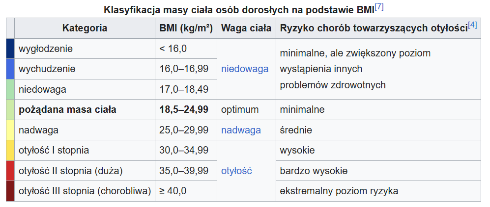
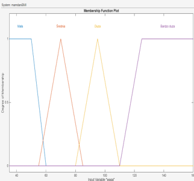
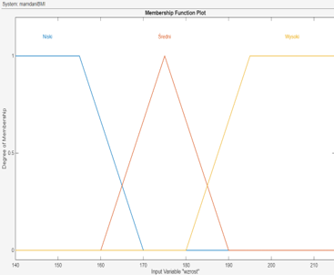
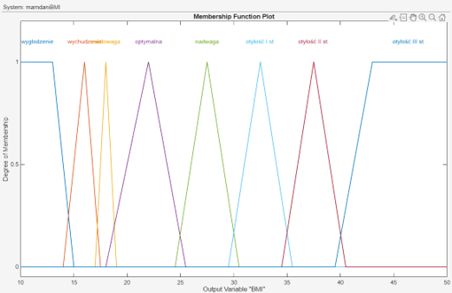
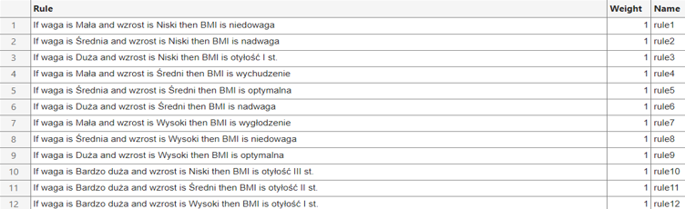
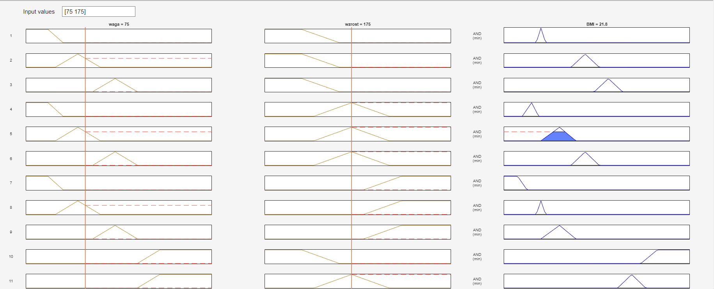
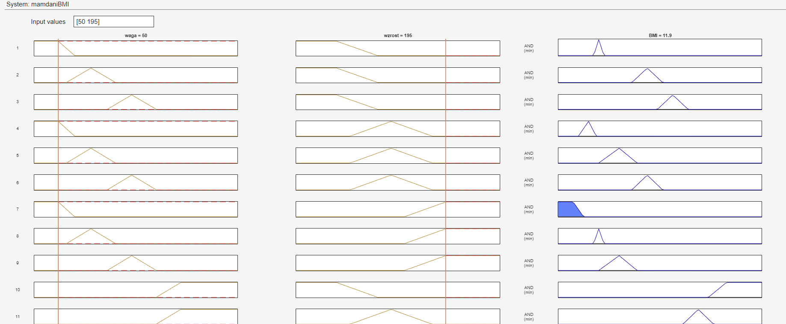
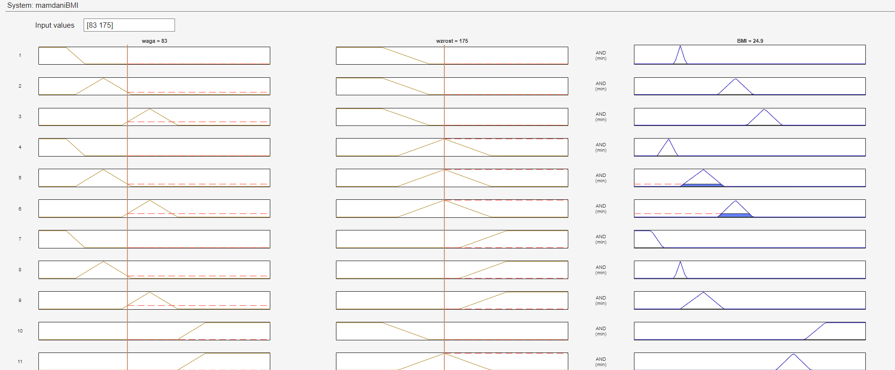
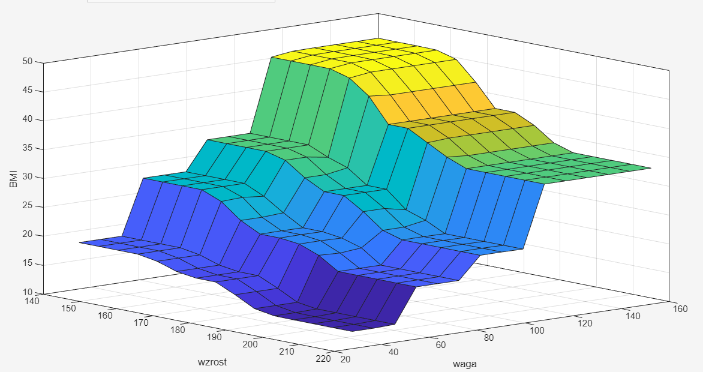
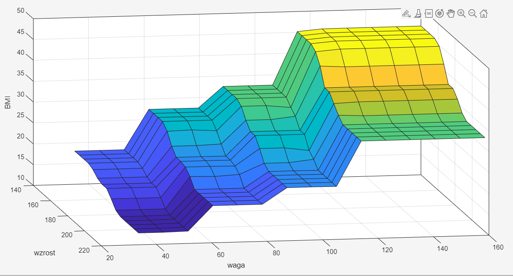

# SPRAWOZDANIE Z PROJEKTU FUZZY LOGIC – WSKAŹNIK BMI
**Kacper Andrzejewski**

## 1. Wstęp
Tematem wykonanego przeze mnie projektu jest wykorzystanie procesów logiki rozmytej i wnioskowania rozmytego na przykładzie wyznaczania wskaźnika BMI danej osoby. Jest to powszechnie uznawany przez środowisko biologów, dietetyków i lekarzy wskaźnik do oszacowania prawidłowości sylwetki ludzkiej pod kątem zdrowotnym, ponieważ pozwala na wstępne określenie tego, czy badana osoba ma (nie)prawidłową wagę w stosunku do budowy swojego ciała. Wedle mojej własnej wiedzy sama miara jest zdecydowanie niewystarczająca do kompletnej oceny czyjegoś stanu fizjologicznego, ponieważ wskaźnik może „oszukiwać” osoby aktywne sportowo np. kulturystów (miara nie rozróżnia masy tkanki tłuszczowej oraz masy mięśniowej dlatego np. zawodowy kulturysta może zostać oszacowany jako osoba z nadwagą), natomiast sama miara jest świetnym przykładem zastosowania logiki rozmytej (tzw. Fuzzy Logic), ponieważ przedziały określoności zaburzeń wynikających z wartości wskaźnika BMI są ściśle ustalone co do 2 miejsca po przecinku. Dzięki zastosowaniu wnioskowania rozmytego oraz odpowiedniej bazy reguł możliwe jest oszacowanie stanu fizycznego osób nie tylko za pomocą pojedynczego wyniku i bezpośredniego dopasowania rezultatu do odpowiedniego przedziału, lecz dzięki użyciu nachodzących na siebie funkcji przynależności na wykresach i tym samym uwzględnienie sąsiadujących ze sobą przedziałów wnioskowania, a w konsekwencji podjęcie lepszej (w sensie optymalizacyjnym i zgodnym ze stanem faktycznym) decyzji dot. wyników badań konkretnej osoby.

## 2. Użyte technologie
Podczas wykonywania projektu użyłem programu MATLAB 2024R wraz z zainstalowanym rozszerzeniem wewnętrznym do przeprowadzania wnioskowania rozmytego, generowania wykresów funkcji przynależności i przestrzennych oraz tworzenie bazy reguł niezbędnej do działania algorytmu – Fuzzy Logic Designer. Zastosowanym systemem FIS był Mamdani Type-1.

## 3. Teoria
Wskaźnik BMI, którego zastosowanie w Fuzzy Logic jest tematem tego projektu, jest trywialną obliczeniowo miarą, ponieważ opisywany jest poniższym wzorem:

$$
BMI = \frac{M}{H^2}
$$

gdzie:
* **M** – masa ciała w kilogramach
* **H** – wzrost w metrach

Jego obliczenie jest na tyle trywialne, że może dokonać tego każdy człowiek zaznajomiony z powyższymi parametrami jego ciała a następnie dokonać prostego wnioskowania w oparciu o ogólnodostępne źródła interpretacji wartości tego wskaźnika. Poniżej znajduje się grafika obrazująca tabelę z wymaganymi informacjami dot. wspomnianej interpretacji:

*(Tabela 1. Źródło: https://pl.wikipedia.org/wiki/Wskaźnik_masy_ciała)*

Jednakże, jak zostało wspomniane wcześniej, sztywne trzymanie się konkretnych wartości co do 2. miejsca po przecinku jest nieodpowiednie (np. osoba o wskaźniku równym 25.0 jest zaklasyfikowana jako osoba z nadwagą, podczas gdy osoba o wskaźniku o 0.01 niższym posiada już pożądaną masę ciała). Dlatego też kluczowe jest tu zastosowanie wnioskowania rozmytego, aby poprawnie zaklasyfikować daną osobę do odpowiedniej kategorii na podstawie jej parametrów fizycznych.

## 4. Przygotowanie programu
Do prawidłowego działania programu potrzebne jest przygotowanie kilku rzeczy, które zostały odpowiednio przygotowane w poniższych etapach:

### ETAP 1 – Przygotowanie zmiennych lingwistycznych
Wprowadzone zostały 2 zmienne wejściowe tj. waga oraz wzrost, które zostały odpowiednio podzielone wedle natury ich wartości tzn.:
* **Waga [kg]** – mała [35, 60], średnia [55, 85], duża [80, 110], bardzo duża [110, 160]
* **Wzrost [cm]** – niski [140, 170], średni [160, 190], wysoki [180, 215]

Oraz zmienna wyjściowa – **BMI**:
* Wygłodzenie -> 10-15
* Wychudzenie -> 14-17.5
* Niedowaga -> 17-19
* Optymalna (pożądana) -> 18-25.5
* Nadwaga -> 24.5-30.5
* Otyłość I st. -> 29.5-35.5
* Otyłość II st. -> 34.5-40.5
* Otyłość III st. -> 39.5-50

Oszacowane przedziały zostały stworzone na podstawie Tabela 1 oraz osobistych decyzji (dot. nachodzenia na siebie funkcji przynależności). Skrajne wartości lingwistyczne dla 3 powyższych zmiennych (2 input + 1 output) są kształtem trapezoidalne, natomiast wszystkie wartości pomiędzy są reprezentowane przez trójkątne funkcje przynależności. Poniżej zostały przedstawione uzupełnienia oraz zobrazowania przedstawionych powyżej wprowadzonych założeń i wartości parametrów:

*(Wykres 1. Funkcja przynależności dla Wagi)*

*(Wykres 2. Funkcja przynależności dla Wzrostu)*

*(Wykres 3. Funkcja przynależności dla BMI)*

Kluczem przeprowadzenia procesu logiki rozmytej jest nachodzenie na siebie wykresów (trapezoidalnych/trójkątnych) poszczególnych zmiennych, aby zobrazować niepewność co do sztywnego wnioskowania na granicach poszczególnych przedziałów miary BMI (zgodnie z Tabela 1). Dzięki temu wnioskowanie rozmyte ma sens – w przeciwnym wypadku algorytm dawałby zbliżone lub identyczne rezultaty, co Tabela 1.

### ETAP 2 – Przygotowanie bazy reguł
Aby system dokonywał poprawnego wnioskowania potrzebuje ustalonej bazy reguł (systemu wnioskowania), dzięki którym będzie sprawdzał wartości klas wejściowych, przyporządkowywał je do odpowiednich zmiennych na podstawie ustalonych uprzednio przedziałów, a następnie dopasowywał odpowiednie reguły, które pozwolą otrzymać żądaną interpretację wskaźnika BMI oraz jego wartość. Utworzone przeze mnie reguły są efektem własnej interpretacji oraz osobistego wnioskowania na podstawie logiki natury i doświadczeń. Poniżej znajduje się kompletna baza reguł złożona z 12 zasad, ponieważ 3 typy klasy Wzrost * 4 typy klasy Waga prowadzi do otrzymania 12 możliwych wyników:

*(Tabela 2. Baza reguł)*

Wskazana zmienna Weight jest wbudowanym parametrem od aplikacji Fuzzy Logic Designer, która umożliwia ustalenie priorytetów zasad podczas wnioskowania, lecz w klasycznych modelach Mamdaniego dla tego typu problemów standardowo przyjmuje się równe wagi dla wszystkich reguł (co zrealizowano również w tym projekcie).

### ETAP 3 – Wybór sposobu defuzzyfikacji
Defuzzyfikacja jest nieodłącznym elementem logiki rozmytej, ponieważ umożliwia otrzymanie liczbowej postaci output’u na podstawie dokonanego wnioskowania. Tu z racji zastosowania medycznego została użyta metoda środka ciężkości, ponieważ równomiernie uwzględnia ona wszystkie fragmenty funkcji przynależności, które obejmują dane wnioskowanie. Skupia się ona na obliczeniu środka ciężkości wielokąta utworzonego w procesie agregacji poszczególnych zbiorów rozmytych, a następnie odczytanie wartości tej średniej ważonej jako rezultatu output’u w postaci liczbowej – tu: konkretna wartość BMI. Cały proces jest wykonywany przez program automatycznie i wymaga jedynie ustalenia wybranej metody defuzzyfikacji. Zarówno zaletą tego jak i istotą całej logiki rozmytej jest fakt, iż program nie wymaga wzoru na wskaźnik BMI, ponieważ oblicza go dokonując odpowiedniego wnioskowania, zalewania – implikacji oraz agregacji – odpowiednich fragmentów podobszarów funkcji przynależności a następnie defuzzyfikacji. Taka procedura prowadzi do otrzymania innych wyników zmiennej wyjściowej niż czyste podstawienie do wzoru, ponieważ uwzględnia ona sąsiadujące fragmenty tworzące wielokąt, jednak jest zbliżona do wyniku oczekiwanego, ponieważ największy peak zawsze znajdzie się tam, gdzie wskazuje na to najbardziej zbliżona funkcja przynależności.

## 5. Opis działania algorytmu
Proces wnioskowania rozmytego przebiega za pomocą kombinacji ustalonych parametrów wejściowych klas lingwistycznych (zmiennych), stworzonej bazy reguł dającej rezultat dla każdej możliwej sytuacji oraz przyporządkowywania i łączenia fragmentów podobszarów odpowiednich funkcji przynależności w połączeniu z defuzzyfikacją. Fragmenty te są tworzone na podstawie wnioskowania Mamdaniego z użyciem funkcji minimum, które polega na wyłuskiwaniu fragmentów funkcji przynależności do poziomów spełnienia przesłanek (minimum) dla danej zmiennej a następnie łączenie wyników z różnych reguł (maksimum). Po dokonaniu defuzzyfikacji otrzymywana jest odpowiedź w postaci liczbowej (output, tu: BMI) oraz wykres z zaznaczonym wielokątem, co zostało przedstawione w poniższych przykładach:

### a) przypadek optymalny: waga=75kg, wzrost=175cm

*(Obraz 1. Rezultat wnioskowania dla przypadku optymalnego)*

Powyższy przykład jest optymalnym przypadkiem, ponieważ celowo zostały wprowadzone wartości sugerujące pożądany wskaźnik BMI (patrz. tabela 1), aby sprawdzić czy system poprawnie dokonuje wnioskowania. Program zdiagnozował tu, aby zastosować zasadę nr 5 (tabela 2). Zobrazował fragment podobszaru funkcji przynależności (kolor niebieski). Indeks BMI umiejscowiony nad 3 kolumną wykresów jest pożądanym wynikiem, co potwierdza, że logika rozmyta zadziałała prawidłowo.

### b) przypadek skrajny: waga=50kg, wzrost=195cm

*(Obraz 2. Rezultat wnioskowania dla przypadku skrajnego)*

Przedstawiony przykład jest odzwierciedleniem ekstremalnie skrajnego przypadku, ponieważ symulowana osoba ma niemalże 2m wzrostu przy czym waży zaledwie 50kg. Jak widać na obrazie 2 system bezwzględnie przyporządkował zasadę nr 7 do tej sytuacji, która wskazuje na wygłodzenie (patrz. tabela 2). Wskazany kolorem niebieskim obszar trapezu oznacza 100% zaklasyfikowanie takiej osoby jako człowieka o skrajnie niskim indeksie BMI.

### c) przypadek reprezentatywny: waga=83kg, wzrost=175cm

*(Obraz 3. Rezultat wnioskowania dla przypadku reprezentatywnego)*

Powyższy przykład został wykonany w celu ostatecznego zaprezentowania działania algorytmu. Jak widać na powyższej grafice, system wnioskowania „rozmył się”, co potwierdza działanie logiki rozmytej, ponieważ nie było możliwe jednoznaczne przyporządkowanie pojedynczej reguły ze względu na nachodzące na siebie przedziały. Oznacza to, iż powyższe parametry fizyczne znajdują się na skraju (części wspólnej) obu funkcji przynależności, dlatego obie reguły (nr 5 oraz 6 – patrz. Tabela 2) zostały wpasowane do wnioskowania.

## 6. Przestrzenna reprezentacja wyników wnioskowania
Dodatkowo za pomocą jednej z funkcji Fuzzy Logic Designer utworzyłem przestrzenny wykres obrazujący wyniki. Został on przedstawiony poniżej w 2 wybranych przekrojach:

| Przekrój nr 1 | Przekrój nr 2 |
|:---:|:---:|
|  |  |
| *(Wykres 4)* | *(Wykres 5)* |

Powyższe wykresy stanowią przestrzenne odzwierciedlenie zależności wartości klas wagi i wzrostu od wskaźnika BMI, co jest napędzane przez zbudowaną bazę reguł i odpowiednie przedziały parametrów. Stanowi to oczywiste potwierdzenie tego, iż wnioskowanie jest nieliniowe i zależne od procedury logiki rozmytej.

## 7. Wnioski końcowe
Przeprowadzone wnioskowanie rozmyte na przykładzie obliczenia wskaźnika BMI jest świetnym akademickim przykładem zastosowania logiki rozmytej w życiu codziennym jak i w środowiskach biznesowych. Umożliwia ona tworzenie złożonych systemów wspomagających podejmowanie decyzji biznesowych, ponieważ opiera się na kombinatoryce odpowiednich fragmentów funkcji przynależności (wskazanych na podstawie parametrów). Możliwość dostosowania bazy reguł oraz ustalenia zakresu parametrów wedle własnych decyzji pozwala na używanie algorytmu logiki rozmytej zgodnie z subiektywnymi założeniami i wymaganiami, dzięki czemu algorytm dokonuje złożonego wnioskowania uwzględniając kilka scenariuszy (pasujących reguł) i umożliwia otrzymywanie w płynny i nieliniowy sposób nietrywialnych (bez użycia czystego wzoru) oraz lepszych (w sensie stanu faktycznego) wyników (np. omija sztywne ułamkowe granice decyzyjne przedstawione na Tabela 1).
