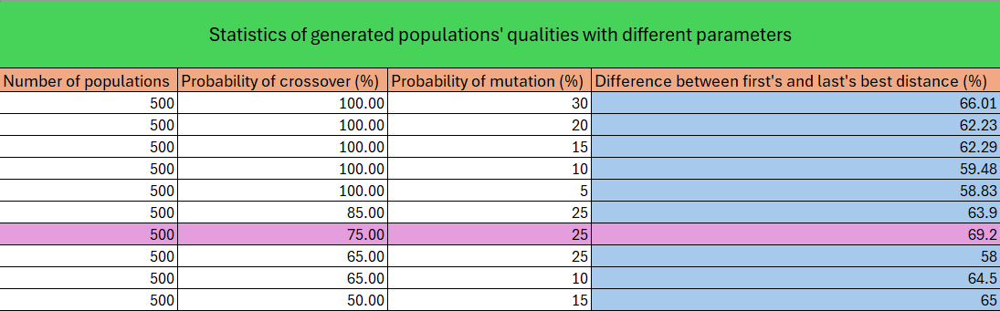
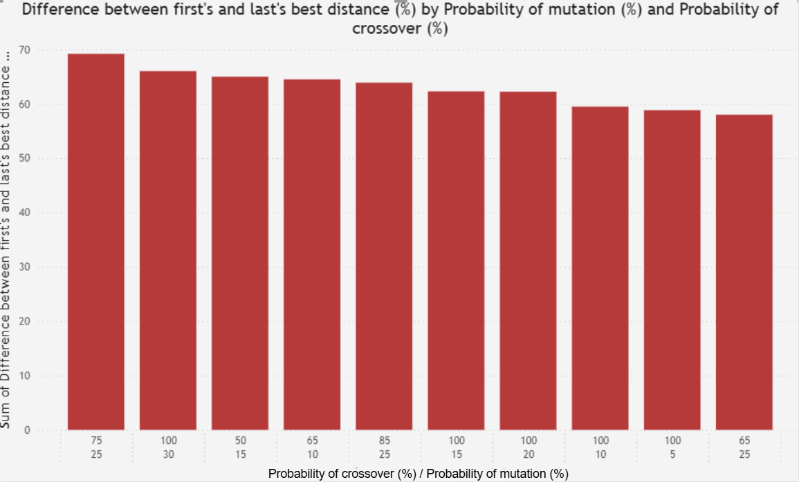
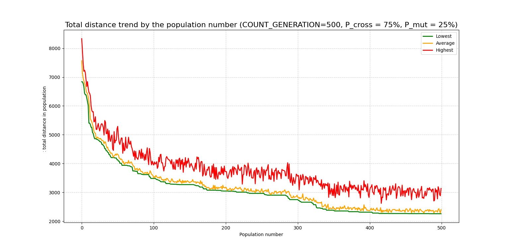

# PROJEKT KOMIWOJAŻERA W OPARCIU O ALGORYTM GENETYCZNY
**Kacper Andrzejewski**

## Wstęp
Przedstawiony projekt dotyczy problemu komiwojażera w oparciu o algorytmy genetyczne. Algorytmy genetyczne są algorytmami stosowanymi w informatyce oraz programowaniu podczas rozwiązywania złożonych (czasem o niewyobrażalnie wysokich złożonościach obliczeniowych) problemów optymalizacyjnych. Ich charakterystyczną cechą jest inspiracja naturą i biologią podczas całej swojej procedury wykonywania, dzięki czemu podejście do znalezienia optymalnych rozwiązań jest zupełnie inne (lecz skuteczne) niż standardowe sposoby (np. używanie algorytmów matematycznych). Ogólny koncept działania polega na mapowaniu biologicznych procesów oraz pojęć tj. populacja, geny, chromosomy, allele, ewolucja (w tym krzyżowanie i mutacja) oraz „prawa dżungli” na kod programistyczny, dzięki czemu podejście „naturalne” staje się niesamowicie ciekawym i dobrze prosperującym sposobem na rozwiązywanie problemów NP-trudnych takich jak problem komiwojażera.

Problem komiwojażera, jako znany problem akademicki, jest przykładem problemu NP-trudnego, ponieważ nie istnieje jeden konkretny i perfekcyjny algorytm, który umożliwiałby skuteczne rozwiązanie o wystarczająco niskiej złożoności obliczeniowej. Jest tak, gdyż ilość wszystkich możliwych permutacji wynosi $n!$, gdzie $n$ to ilość punktów/miejsc do odwiedzenia. Cały problem polega na minimalizacji dystansu, jaki do przebycia ma komiwojażer (np. kurier) podczas odwiedzania wszystkich punktów (np. miast) na mapie tylko raz w dowolnej kolejności – przypomina to graf Hamiltona, przy czym musi zacząć i skończyć podróż w tym samym (wybranym przez siebie – lub algorytm) miejscu. W związku z bardzo dużą złożonością obliczeniową ($n$ miast), każda kolejna inkrementacja tej wartości implikuje coraz to więcej możliwości, których człowiek a nawet komputer działający w oparciu o algorytmy matematyczne zawodzi (ekstremalnie wysoki czas dokonywania obliczeń w celu poszukiwania najbardziej optymalnego rozwiązania). Problem ten jest książkowym przykładem zastosowania algorytmów genetycznych dzięki ich losowości przy wyborze osobników oraz możliwością skutecznej manipulacji w celu uzyskania ekstremów lokalnych, a nawet globalnego.

## Użyte technologie do przeprowadzenia algorytmu
* **Python 3.12** – `Pandas`, `Numpy`, `Seaborn`, `Matplotlib`, `random`, `time`
* **Microsoft Excel** – generacja tabelki porównującej parametry i wyniki
* **Microsoft PowerBI** – generacja wykresu słupkowego

## Założenia
Z racji tego, iż algorytmy genetyczne są inspirowane naturą, wprowadzana jest terminologia biologiczna podczas programowania, aby zachować spójność pomiędzy tymi dwoma obszarami oraz dokładnie odzwierciedlić procesy występujące w przyrodzie. Poniższa reprezentacja jest kluczowa do zrozumienia i interpretacji w celu dalszych rozważań:

* **Gen** – pojedynczy punkt
* **Chromosom** – zestaw $N$ ilości genów (osobnik)
* **Populacja** – zestaw $M$ ilości chromosomów, Pokolenie
* **Locus** – pozycja (indeks) genu
* **Ewolucja** – procesy transformujące chromosomy, w tym:
    * **Krzyżowanie** – wymiana zestawu złożonego z losowej ilości genów pomiędzy dwoma osobnikami
    * **Mutacja** – wymiana miejsc (locusów) między 2 losowymi genami w obrębie jednego osobnika
* **Fitness** – funkcja dopasowania, tu: łączny dystans po odwiedzeniu wszystkich punktów – dążymy do jej minimalizacji w celu znalezienia jak najbardziej optymalnej trasy
* **Prawo dżungli** – Mechanizm doboru naturalnego – swoiste przybliżenie procesu selekcji osobników polegające na wyborze najsilniejszych chromosomów (tych o jak najlepszej fitness)
* **Selekcja** – wybór osobników, tu: **elitarna** – do następnego pokolenia przechodzi 2 najsilniejszych osobników a pozostali są tworzeni poprzez ewolucję wybranych chromosomów poprzedniej populacji

Takie założenia są kluczowe dla następnych procesów, ponieważ pozwalają zachowywać się komputerowi podobnie do rzeczywistego świata przyrody działającego wg jej założeń.

## Opis wstępnego działania
Problem, mimo iż jest zazwyczaj przedstawiany na przykładzie miast w kraju, tu został zaimplementowany na kwadracie 300x300 px a miasta zostały zainicjowane poprzez wylosowanie $N$ ilości punktów (a konkretnie ich współrzędnych $x,y$ w obrębie zadanego pola). Generacja punktów jest domyślnie za każdym razem losowa, natomiast w celach porównawczych dla końcowych rezultatów otrzymanych dla różnych parametrów została tutaj ujednolicona (ziarno generatora losowego jest stałe). Dzięki temu możliwe będzie późniejsze dokonanie wnioskowania, gdyż dla różnych punktów startowych oraz losowań wyniki byłyby różne i trudniej byłoby wskazać arbitralne najlepsze wartości parametrów. Natomiast warto zauważyć, iż algorytm będzie działał skutecznie (tzn. dokonywał optymalizacji) dla dowolnego zestawu punktów startowych.

Kolejnym etapem było stworzenie $M$ chromosomów o liczebności $N$ punktów, gdzie każdy chromosom zawiera $N$-elementowy zestaw genów (punktów) w wygenerowanej przez generator liczb pseudolosowych kolejności (dla każdego oddzielnie). Każdy chromosom utrzymuje brak powtarzalności genów, dzięki czemu założenie o braku odwiedzania każdego punktu więcej niż raz zostaje spełnione. Otrzymane rezultaty zostały wpisane do tabeli (patrz: kod dołączony do sprawozdania).

Następnym krokiem było użycie zaimplementowanej własnoręcznie funkcji dystansu obliczającej odległość euklidesową pomiędzy każdą parą różnych punktów, wykorzystując ich współrzędne $x,y$ w następujący sposób:

$$
d = \sqrt{(x_2 - x_1)^2 + (y_2 - y_1)^2}
$$

gdzie $x_1$ i $x_2$ to para pierwszych wylosowanych współrzędnych a $y_1$ oraz $y_2$ to para drugich wylosowanych współrzędnych spośród dowolnej pary punktów.

Po obliczeniu wszystkich dystansów stworzono dodatkową zmienną w tabeli – `sum_dist`, która obrazuje sumę odległości dla każdego chromosomu, a taką tabelę posortowano wg tej zmiennej w rosnącej kolejności. Operacja ta sprawiła, iż została wygenerowana pierwsza populacja a widok posortowanej tabeli pozwolił na wstępną ocenę każdego chromosomu poprzez wartości sumy dystansu (dążenie do minimalizacji funkcji dystansu – rosnąca kolejność).

## Opis dalszego działania – wyjaśnienie pojęć
Następnym etapem jest przejście do sedna problemu czyli rzeczywistej optymalizacji rozwiązania problemu poprzez zastosowanie procesów algorytmu genetycznego. Dotychczasowo wygenerowana pojedyncza populacja jest zaledwie szkicem i fundamentem opisanego w dalszej części sprawozdania procesu i oczywiście nie przedstawia końcowych rezultatów. W celu możliwości jasnej interpretacji przyszłych działań poniżej zostały przedstawione objaśnienia sposobów użytych w programie Python jako mapowania procesów biologicznych na informatykę:

### Krzyżowanie
Operacja ta w biologii polega na rozmnażaniu dwóch osobników (rodziców) w celu powstania kolejnych (dzieci) poprzez wspólną wymianę genów. Umożliwia to stworzenie nowych populacji z nowopowstałych dzieci, które często są kombinacją kluczowych i najlepszych genów obu rodziców. Ponadto takie procesy czasem umożliwiają wyprodukowanie znacznie lepszych osobników, ponieważ okazuje się niespodziewanie, iż para 2 rodziców o pojedynczych przeciętnych wartościach w kontekście funkcji celu w połączeniu ze sobą tworzy znakomitych potomków. W środowisku programistycznym zostało to zaimplementowane jako iteracyjne tworzenie dziecka z dwóch iteracyjnie losowo wybranych osobników starej populacji poprzez iteracyjne losowanie locusów rodziców i bezpośredniej wymiany genów między nimi. W ten sposób tworzy się iteracyjnie nowa populacja.

Podczas implementacji należy zastosować tzw. **Ordered crossover**, ponieważ zazwyczaj dochodzi do sytuacji, w której geny przekazywane z 1 do 2 rodzica są duplikatami genów istniejących już w zestawie genów 2 rodzica. Z założenia chromosomy muszą zawierać tylko unikalne punkty, zatem wskazane jest dokonanie bardziej złożonego procesu kopiowania niż tylko bezpośrednie przeniesienie genów. Polega ono na przepisaniu kopiowanego fragmentu z 1 rodzica do potomka (identyczne locusy). Pozostałe brakujące geny potomka są kolejno dodawane do chromosomu (od lewej do prawej) od 2 osobnika starej populacji pomijając geny dublujące się z pochodzącymi od 1 rodzica. Dopiero dzięki temu operacja krzyżowania jest przeprowadzana pomyślnie i sukcesywnie powstają chromosomy nowego pokolenia, a założenie o niepowtarzalności punktów w zestawach jest spełnione mimo połączenia ich losowo ułożonych genów. Operacja krzyżowania (tzw. *Crossover*) jest kluczowym etapem tworzenia nowych pokoleń oraz istotą genetyki algorytmu, ponieważ pozwala na osiąganie celów optymalizacji losowo w sensie ewolucyjnym i stworzenie sensownych rozwiązań z początkowego chaosu.

### Mutacja
Proces ten jest kolejnym obok krzyżowania schematem tworzenia jeszcze lepszych w sensie optymalizacyjnym funkcji celu osobników. Polega na wymianie pojedynczych genów na losowo wybranych 2 różnych locusach w obrębie jednego chromosomu. Zamienione allele skutkują delikatną zmianą, lecz może ona często okazać się kluczowa. W przyrodzie proces ten znany jest jako mutacje genowe np. u ssaków i powoduje zarówno poważne schorzenia jak i przejawy geniuszu. Mapowanie tej operacji na informatykę i algorytmy genetyczne skutkuje tymi samymi efektami, bowiem możliwe jest całkowite oderwanie od schematu i stworzenie wadliwego osobnika, jak i niespodziewane znalezienie optimum funkcji celu. Podobnie jak w biologii, istnieje mała szansa na wystąpienie mutacji, co zostanie odzwierciedlone później w algorytmie.

Warianty mutacji mogą być różne – można skupić się na wymianie alleli na 2 pojedynczych miejscach, można przesuwać wybraną grupę genów o pewną ilość miejsc (locusami), natomiast zaproponowanym przeze mnie autorskim rozwiązaniem jest dokonanie mutacji zależnej od faktycznej wartości genu (tj. przypisanej mu liczby) i odpowiednie przesunięcie (dana wartość jest wyłącznie reprezentatywna tzn. nie stanowi rankingu wag punktów, a jedynie reprezentuje nr punktu $n$, który zostaje odwiedzony w $n$-tej kolejności). Cały schemat działania jest trywialny, ponieważ opiera się na zamianie miejscami (locusami) 2 genów: za pomocą generatora liczb pseudolosowych wybierany jest locus, sprawdzana jest wartość reprezentatywna przypisana wcześniej (tu: $X$) do tego genu (punktu na mapie) po czym następuje zamiana genu z genem oddalonym od $X$ miejsc (locusów). Oczywiście w przypadku wyjścia poza zakres chromosomu tzn. gdy locus docelowy (2 genu) – suma locusa początkowego (1 genu) i jego wartości matematycznie wskazuje na wartość locusa poza zakresem (np. wylosowanie genu na locusie nr 14 o wartości 10 wskazuje na locus $14+10=24$, a do dyspozycji jest $N=20$ locusów $\rightarrow 24 > 20$) dokonywana jest operacja modulo ($\%$) z $N$, dzięki czemu przy osiągnięciu max. zakresu dalsze przesuwanie następuje od początku chromosomu (np. wylosowanie genu na locusie nr 14 o wartości 10 powoduje dojście do końca zakresu locusów o $N=20 - 14 = 6$ miejsc a następnie dalsze przesunięcie od początku chromosomu o $(10 - 6)\%20 \rightarrow 4$ miejsc). Dodatkowo, aby utrzymać sens operacji w przypadku wylosowania genu o wartości $M$, losowana jest wartość o którą należy przesunąć gen (ilość locusów) z zakresu od 1 do $M$ dotąd aż nie będzie równa $M$, aby nie dopuścić do wymiany z samym sobą i przeprowadzić faktyczną mutację. Wg literatury prawdopodobieństwo wystąpienia mutacji pojedynczego allela to $1/L$, gdzie $L$ to długość chromosomu, natomiast należy rozróżnić tą wartość od zastosowanego później w algorytmie prawdopodobieństwa wystąpienia mutacji całego chromosomu.

### Sukcesja
Jednym z etapów przeprowadzania algorytmu genetycznego jest sukcesja, która odpowiada za selekcję osobników ze starszego pokolenia do nowotworzonego. W wykonanym projekcie komiwojażera użyta została sukcesja elitarna, która powoduje, iż przy tworzeniu iteracyjnie nowych populacji, dwóch najlepszych (w sensie optymalizacyjnym funkcji dystansu) zostaje przekopiowanych do początkowej populacji bez żadnych zmian. Pozwala to na zachowywanie uzyskanych, najlepszych w czasie ewolucji, osobników, ponieważ są oni bardzo wartościowi w procesie uzyskiwania optimum. Taki schemat może prowadzić do zatrzymywania się w lokalnych ekstremach, co z reguły jest niepożądane, gdyż celem jest znalezienie globalnie najlepszego rozwiązania. Natomiast proces ten jest konieczny, aby utrzymywać jakość postępującej iteracyjnie ewolucji i nie rezygnować (i nie mutować) otrzymywanych zadowalających rozwiązań. Należy pamiętać, iż osobniki mogą (ale nie muszą – zależnie od dynamicznie uzyskiwanych wyników funkcji celu z mutacji dynamicznie tworzonych osobników) być na topie uzyskiwanych populacji przez wiele generacji. Ponadto warto przypomnieć, iż cały proces charakteryzuje losowość, a tylko doborem odpowiednich parametrów można sterować osiągami algorytmu genetycznego, dlatego też wybrańcy uzyskani w wyniku sukcesji elitarnej i przechodzący do następnych pokoleń mogą być zadowalający tylko lokalnie, a stworzeni osobnicy w wyniku już nie kopii, lecz krzyżowań i mutacji poprzedniego pokolenia mogą prowadzić do osiągania globalnie najlepszych rozwiązań.

## Opis dalszego działania – generowanie populacji
Generowanie populacji, czyli *core* algorytmu genetycznego, jest schematyczne i kończy się osiągnięciem warunku zakończenia. Może to być uzyskanie docelowych i pożądanych wartości funkcji celu, lecz tutaj zastosowano warunek STOPu po wygenerowaniu $K$-tej populacji. Aby jasno określić warunki postępowania, poniżej znajduje się schemat algorytmu genetycznego w punktach (po wygenerowaniu populacji początkowej zgodnie z wcześniejszym opisem):

1. Została wygenerowana populacja początkowa złożona z $M$ chromosomów o $N$-liczebności punktów bez duplikatów.
2. Za pomocą listy rankingowej wybierane jest 25% najlepszych (w sensie optymalizacyjnym funkcji celu) osobników, którzy są pulą rodziców do przeprowadzania ewolucji. Pozostałe 75% posortowanej listy jest tracone bezpowrotnie.
3. Następuje **selekcja elitarna**, która sprawia, iż do nowej populacji kopiowanych jest top 2 rodziców ze starej populacji.
4. Z puli 25%-towej losowanych jest iteracyjnie 2 rodziców, którzy z prawdopodobieństwem zrealizowania krzyżowania ($P_c$) są krzyżowani i wydają potomstwo (pojedynczego osobnika), który dołącza do nowej populacji. Jeśli $P_c$ nie zostanie osiągnięte, to losowo wybrany z 2 rodziców osobnik starej populacji jest kopiowany bezpośrednio do nowej.
5. Z prawdopodobieństwem zrealizowania mutacji ($P_m$) dokonywana jest mutacja osobnika uzyskanego w punkcie 3. Jeśli $P_m$ nie zostanie osiągnięte, to dziecko nie jest mutowane i staje się finalnym wynikiem ewolucji.
6. Proces 4-5. jest iteracyjnie powtarzany, aż do osiągnięcia nowej populacji o liczebności $M$ chromosomów. Gdy zostanie to osiągnięte, nowa populacja staje się starą populacją a kroki 1-5. są powtarzane iteracyjnie aż do osiągnięcia warunku stopu.

Cały powyżej przedstawiony proces jest istotą algorytmu genetycznego, ponieważ, jak wspomniano wcześniej, nie opiera się on na konkretnych analitycznych (matematycznych), gotowych wzorach przy osiąganiu optimum globalnego funkcji celu, lecz na wykorzystaniu siły natury i jej praw. Mechanizm doboru naturalnego (prawo dżungli) jest odzwierciedlony tutaj jako panująca w przyrodzie zasada o tym, iż przetrwają najsilniejsi, ponieważ do następnych populacji iteracyjnie wybieranych jest ćwierć osobników jako najlepiej przystosowani rodzice mogący stworzyć potencjalnie jeszcze lepsze potomstwo. Takie podejście nie zawsze pozwala na znalezienie pewnego, globalnego optimum jako stałego rozwiązania problemu, natomiast umożliwia alternatywne podejście, dzięki któremu osiągane wyniki mogą być nawet i perfekcyjne.

## Przedstawienie uzyskanych wyników
Po osiągnięciu warunku zakończenia algorytmu należy przejść do zobrazowania i interpretacji wyników, dzięki czemu możliwy będzie wgląd w działanie algorytmu od strony graficznej. Warto przypomnieć, iż w celu testowania parametrów umożliwiających osiąganie optymalnych wyników użyto ziarna generatora liczb pseudolosowych, aby utrzymać stałą losowość.

Poniżej została przedstawiona animacja GIF obrazująca drogę jaką wybiera algorytm dla komiwojażera tzn. w każdej generacji pokazana została najbardziej optymalna zgodnie z listą rankingową, złożoną z $M=30$ chromosomów, trasa poprzez wszystkie $N=50$ punktów. Oczywiście punkt startu/mety również jest dobierany losowo, tzn. jako punkt znajdujący się na locusie nr 1 obecnego chromosomu. Obok nr generacji nad wykresem, wypisano również dystans aktualnie (w danej populacji) obrazowanej trasy (tj. najbardziej optymalny – najniższy – wynik sumy dystansów pomiędzy miastami). Warunkiem zakończenia jest uzyskanie $K=500$ populacji w iteracji, ponieważ jest to PRAWDOPODOBNIE wystarczająca ilość do wygenerowania, aby zaszła dostateczna optymalizacja, co zostanie pokazane później.

*(Animacja GIF – ewolucja optymalnej trasy w cyklu K populacji)*

Następną prezentacją wyników jest tabela wykonana w programie MS Excel, gdzie zostały wpisane wyniki procentowych różnic pomiędzy (stałą) początkową wartością sumy dystansu euklidesowego a wielkością finalną z $K$-tej populacji. Wyniki zostały wygenerowane dla różnych wartości parametrów tj. Probability of crossover (%) - prawdopodobieństwo zrealizowania krzyżowania oraz Probability of mutation – prawdopodobieństwo zrealizowania mutacji. Parametry $K$ – Number of populations oraz $N$ – ilość punktów do odwiedzenia (genów w chromosomie) i $M$ – ilość chromosomów (osobników) w pojedynczej populacji są stałe i wynoszą odpowiednio 500, 50, 30.

*(Tabela 1. Prezentacja statystyk różnic w min_dist 1 i K-tej populacji dla różnych wartości parametrów)*

Powyższa tabela jest niezwykle użyteczna do pokazania, jak wynik końcowy (tj. osiągnięte optimum) jest zależne od doboru odpowiednich parametrów. Zostało przeprowadzonych 10 testów dla wielkości zobrazowanych w tabeli, a wyniki procentowe są odzwierciedleniem jakości uzyskanych populacji. Fioletowym kolorem został zaznaczony wiersz o największej różnicy procentowej między najniższym `min_dist` 1 i $K$-tej populacji tzn. najlepsze wartości parametrów spośród testowanych.

Ponadto, poniżej przedstawiono graficzną reprezentację powyższych wyników jako wykres słupkowy wygenerowany w Microsoft PowerBI.

*(Wykres 1. Wykres słupkowy różnicy procentowej między najniższym min_dist 1 i K-tej populacji w zależności od wartości parametrów)*

Powyższy wykres obrazuje graficznie wspomniane różnice procentowe w zależności od dobranych parametrów. Wartości z ostatniej kolumny Tabeli 1. zostały uporządkowane malejąco.

W związku z tym, iż zostało pokazane, że dla Probability of crossover = 75% oraz Probability of mutation = 25% nastąpiła najlepsza poprawa w sensie optymalizacyjnym sumy dystansów pomiędzy punktami, poniżej został przedstawiony wykres liniowy obrazujący drogę algorytmu dokonującego optymalizacji trasy w wyniki przedstawionego uprzednio schematu ewolucji. Pokazana została najlepsza trasa tj. o najniższym dystansie, średnia dla wszystkich $M$-chromosomów oraz najniższa tj. o największym dystansie dla danej populacji od 1 do $K$-tej.

*(Wykres 2. Wykres liniowy sumy dystansów w danej populacji)*

Zielona linia na wykresie oznacza najniższą wartość sumy dystansu w danej populacji (tj. najlepszą), żółta oznacza średnią natomiast czerwona najgorszą wartość tej sumy.

## Wnioski końcowe
Problem komiwojażera jako problem NP-trudny jest doskonałym przykładem problemu, który da się rozwiązać algorytmem genetycznym. Inspiracja biologią, zachowanie jej praw oraz wykorzystanie ich do przeprowadzania ewolucji pozwala na stworzenie rozwiązania wykraczającego poza przestrzeń analitycznych rozwiązań a opierającego się na traktowaniu populacji wielu tworzonych rezultatów jako osobników i przeprowadzania na nich operacji inspirowanych naturą. Przeniesienie (mapowanie) tych procesów na kod programistyczny pozwala na zachowywanie się programu jako informatycznej realizacji genetyki obecnej w przyrodzie od zawsze. 

Wspomniane prawo dżungli znajduje odzwierciedlenie przy wyborze osobników do następnych populacji, a nowe chromosomy są tworzone w wyniku naturalnych schematów genetycznych, dzięki czemu algorytm nie zatrzymuje się tylko na rozwiązaniu lokalnym, lecz ma bardzo duże szanse osiągnięcia globalnego optimum. Przedstawione wykresy obrazują zachowywanie się algorytmu w sposób ewolucyjny, ponieważ, zgodnie z zasadą, iż z chaosu (populacji początkowych) najłatwiej jest dokonać uporządkowania, widoczny jest ogromny wzrost jakości otrzymywanych rozwiązań w początkowych iteracjach, natomiast przy dalszych generacjach wykres liniowy (Wykres 2.) udowadnia, że algorytm osiąga zbieżność po około $K$ iteracjach, co oznacza, że ewolucja zaczyna opierać się na ekstremum lokalnym (lub globalnym) i dalsze iteracje nie przynoszą gwałtownej poprawy.

Dodatkowo otrzymane różnice procentowe w tabeli 1. zobrazowane na wykresie 1. stanowią potwierdzenie, iż dobór parametrów prawdopodobieństw jest kluczowy, aby otrzymać coraz to lepsze wyniki – jak się okazało 75% $P_c$ oraz 25% $P_m$ pozwoliło na zredukowanie sumy długości trasy (wartości funkcji dystansu) o ok. 70%! Jest to bezsprzeczne potwierdzenie na to, iż zachodzi ogromna optymalizacja dzięki ewolucji algorytmu genetycznego. 

W przypadku wizualizacji trasy w powyższej animacji GIF można zauważyć, iż algorytm ciągle ewoluuje – nie tylko pod względem doboru odpowiedniej ścieżki odwiedzenia wszystkich punktów, lecz również co do wyboru miejsca startu/stopu, co świadczy o osiągnięciu pożądanego zachowania algorytmu. Oczywiście trasa komiwojażera mogłaby finalnie zostać ręcznie zoptymalizowana na podstawie finalnych poprawek ludzkich, a sam końcowy rezultat nie musi być globalnym minimum w kontekście rozwiązania problemu, natomiast tak znacząca poprawa i zachodząca optymalizacja jest wystarczającym dowodem na użyteczność zastosowania tego typu operacji w kontekście rozwiązań problemów NP-trudnych, ponieważ, jak udowodniono, algorytmy inspirowane naturą znajdują świetne zastosowanie w inteligencji obliczeniowej dla problemów biznesowych.
