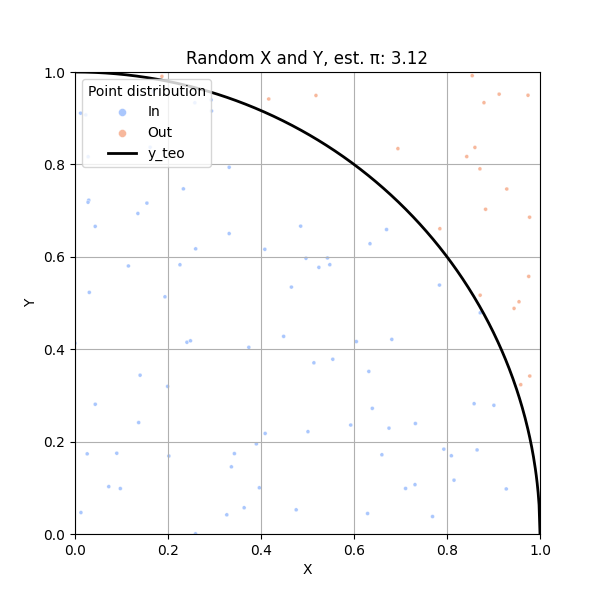
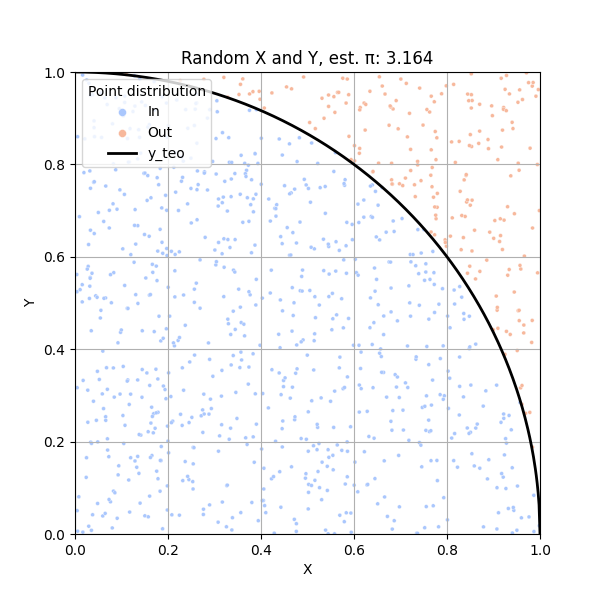
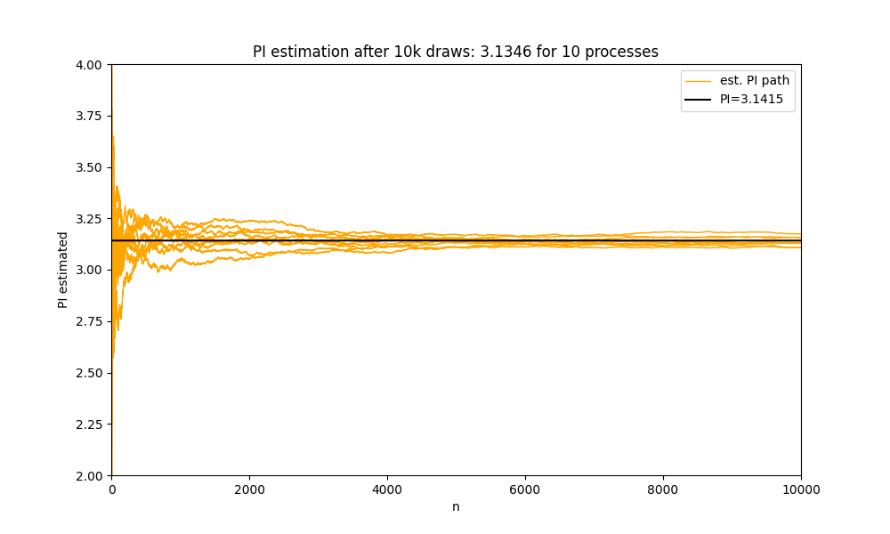
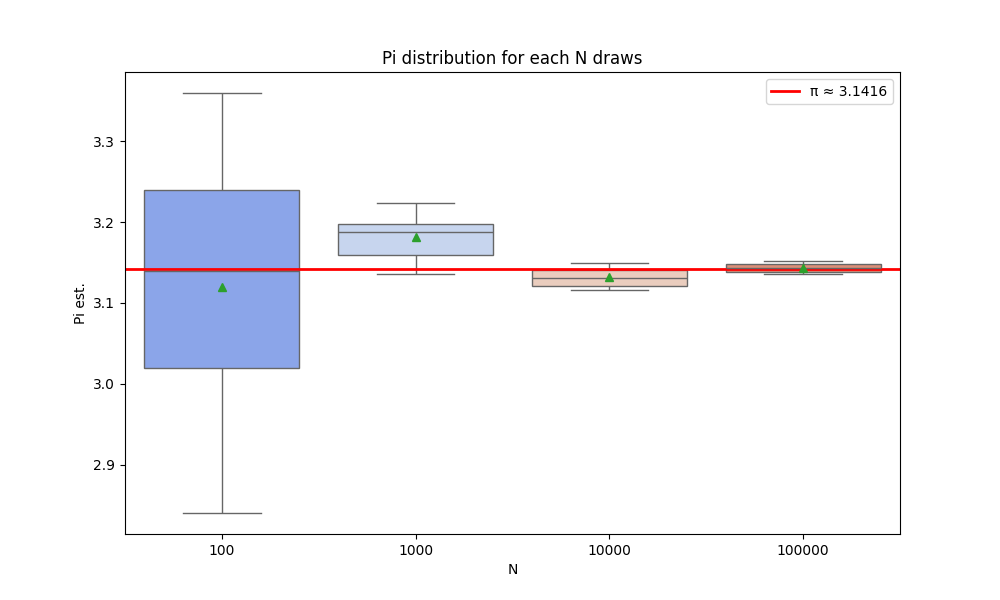

# PREZENTACJA ALGORYTMU MONTE CARLO NA PRZYKŁADZIE ESTYMACJI LICZBY PI
**Kacper Andrzejewski**

## Etap 1. Wstęp i opis działania
Algorytm Monte Carlo został opracowany przez węgierskiego wielkiego matematyka Johna von Neumanna wraz z Stanisławem Ulamem podczas realizacji projektu Manhattan (stworzenie pierwszej bomby atomowej) w latach 40. XX wieku.

Proces ten polega na wyestymowaniu wyników pewnych skomplikowanych oraz nierozwiązywalnych (lub rozwiązywalnych, lecz w bardzo długim okresie czasu) analitycznie operacji oraz problemów matematycznych poprzez zastosowanie wielokrotnego generowania losowych wartości zgodnie z określonym rozkładem, dzięki czemu otrzymany wynik jest zbliżony (na tyle, że można go uznać za wystarczające przybliżenie rezultatu możliwie otrzymanego metodą analityczną) do prawdziwego (lub żądanego) – naturalnie jest on oparty na prawdopodobieństwie.

Metoda Monte Carlo daje tym lepsze (dokładniejsze) wyniki, im większa jest ilość iteracji (losowań) podczas przeprowadzania procesu. Dzięki tej metodzie skomplikowane do obliczenia analitycznie działania matematyczne mogą zostać zastąpione procesem probabilistycznym (stochastycznym), który jest znacznie łatwiejszy do przeprowadzenia, dając przy tym wiarygodne wyniki.

Jednym z klasycznych przykładów zastosowania algorytmu Monte Carlo jest estymacja liczby $\pi$. Opiera się on na wykorzystaniu kartezjańskiego układu współrzędnych, na którym znajduje się okrąg o środku w (0,0) i promieniu $r$. Jest on podzielony na ćwiartki i tylko jedna z nich jest wykorzystywana (tu: 1. ćwiartka, $r = 1$). Następnie dokonuje się losowania współrzędnych $x$ oraz $y$ z jednorodnego rozkładu – otrzymane wartości są w przedziale $[0,1)$, dlatego też zostaje użyta wspomniana ćwiartka (znajduje się ona w obszarze kartezjańskiego układu, gdzie obie współrzędne są nieujemne).

Ilość iteracji tj. przeprowadzonych losowań $N$ jest dodatnią liczbą naturalną – im większą, tym dokładniejszy ostateczny wynik (dokładniejsza estymacja). Jeśli przez $t$ oznaczymy ilość trafionych punktów (tych, które znajdują się wewnątrz okręgu – ćwiartki), a przez $w$ ilość wszystkich punktów, które zostały wylosowane (ostatecznie $N$) (zakładamy, iż stosunek pola ćwiartki do pola kwadratu o boku $r$ – ćwiartki układu współrzędnych – jest równoważny stosunkowi $t$ do $w$), to w poniższy sposób można otrzymać wzór na liczbę $\pi$:

$$
\frac{\frac{1}{4} \pi r^2}{r^2} = \frac{t}{w}
$$
(1.1)

Po dalszych przekształceniach wzoru 1.1 otrzymujemy:

$$
\pi = 4 \cdot\frac{t}{w}
$$

Z otrzymanej powyżej zależności wynika fakt, iż liczbę $\pi$ można wyestymować na zadanym obszarze jako iloraz poczwórnej ilości punktów trafionych oraz wszystkich wylosowanych punktów (zakładając równoważność stosunku odpowiednich pól do stosunku ilości odpowiednich typów punktów).

## Etap 2. Przeprowadzenie procesu z użyciem języka Python (3.12)
Do wykonania tego algorytmu użyłem języka Python w wersji 3.12 – kod znajduje się w załączonym pliku `.py`. Zostało przeprowadzone odpowiednio $N = \{100, 1000, 10000, 100000\}$ iteracji, aby porównać wyestymowane wartości z rzeczywistą $\pi$. 

Dodatkowo wykonałem wykresy: zobrazowanie wylosowanych punktów w układzie współrzędnych, proces dążenia estymowanej wartości do prawdziwej wraz z kolejnymi iteracjami oraz wykresy typu ramka-wąsy obrazujące rozkład wyliczonych wartości dla poszczególnych $N$. Wszystkie wyliczone wielkości $\pi$ powstały w wyniku iteracyjnego użycia wzoru 1.1.

## Etap 3. Wykresy

| N = 100 | N = 1000 |
|:---:|:---:|
|  |  |
| *(Rys. 3.1)* | *(Rys. 3.2)* |

| N = 10000 | N = 100000 |
|:---:|:---:|
|  |  |
| *(Rys. 3.3)* | *(Rys. 3.4)* |

Na powyższych wykresach zostały zobrazowane wszystkie punkty dla poszczególnej ilości losowań $N$ na 1. ćwiartce układu współrzędnych. Zostały one oddzielone ćwiartką okręgu (czarna linia) oraz odpowiednio pokolorowane – $t$ – trafione, niebieskie, oraz nietrafione, pomarańczowe. Ponadto w tytułach wykresów podałem wyestymowaną, końcową wartość liczby $\pi$ w N-tej iteracji.

**Droga dążenia estymowanej wartości do rzeczywistej w miarę kolejnych iteracji**

*(Rys. 3.5)*

Na powyższym wykresie zostały przedstawione drogi dążenia wyliczanych wartości (1.1) dla każdego $n \in [1, N = 10000]$ dla 10 identycznych przeprowadzonych procesów losowań punktów $N$ razy. W tytule wykresu została podana przybliżona wartość liczby $\pi$ jako średnia z wartości dla $N=10000$ iteracji wszystkich 10 procesów. Na wykresie widoczna jest zmienność estymacji od początku każdej iteracji aż do jej finału wraz z wartością rzeczywistą liczby $\pi$ (czarna prosta).

**Wykresy typu ramka-wąsy dla każdego zestawu 10 finalnych estymacji dla każdego N**

*(Rys. 3.6)*

Powyżej przedstawione są wykresy typu Boxplot jako zobrazowanie rozkładu wartości dla 10 finalnych estymacji $\pi$ dla każdego $N$ (tzn. zostało przeprowadzone 10 procesów Monte Carlo dla $N=100$ i z 10 finalnych wartości wykonano wykres ramka-wąsy, potem dla $N=1000$ itd.). Dodatkowo na wykres nałożono prostą jako obraz rzeczywistej wartości $\pi$ (dla porównania).

## Etap 4. Wnioski
Podsumowując, przeprowadzony proces estymacji liczby $\pi$ za pomocą algorytmu Monte Carlo wykazał, iż, zgodnie z przewidywaniami, wraz ze wzrostem iteracji $N$ wartość wyliczana jest coraz bliższa prawdziwej tj. ok. 3.141592. W wyniku losowania współrzędnych punktów z rozkładu równomiernego, dla kolejnych wartości parametru $N$ poszczególne obszary (ćwiartka koła oraz ćwiartka układu współrzędnych) są coraz bardziej pokryte w równomierny sposób (rys. 3.1-3.4), co oznacza, że wyliczany iloraz (zgodnie ze wzorem 1.1) jest coraz bardziej wiarygodny względem rzeczywistej wartości $\pi$.

Takie samo zjawisko jest widoczne na wykresie 3.5, gdzie dla każdej z 10 przeprowadzonych serii dla $N=10000$, każda droga dąży ostatecznie do wartości teoretycznej mimo różnych początków (małe $N$). 

Dodatkowo rozbieżność ta jest widoczna na ostatnim wykresie (3.6), gdzie rozkład wartości przedstawiony za pomocą wykresów Boxplot jest definitywnie coraz węższy wraz ze wzrostem ilości iteracji $N$ i coraz bliższy medianą do wartości teoretycznej, co po raz kolejny świadczy o wzroście wiarygodności wartości estymowanej dla coraz większej ilości losowań. 

Ostatecznie otrzymany wynik (dla $N=100000$) różni się od prawdziwej wartości o mniej niż 0.01, zatem algorytm wykazał się pełną użytecznością do tego typu symulacji. Monte Carlo, mimo swojego leniwego podejścia, jest bardzo dobrym narzędziem do rozwiązywania błahych zadań (jak estymacja liczby $\pi$), jak i do bardzo złożonych problemów.
